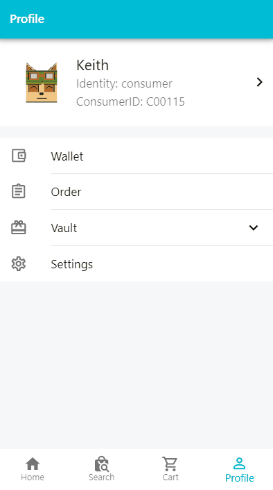
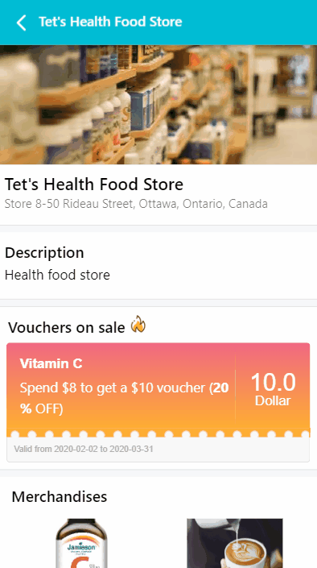

# BizMSM-ecommerce-application

Our application is under development and stored in a private repository. BizMSM targets local merchants around cities in North America, and provide a possible solution to them to sell their goods and products online whether they are selling crafts, running restaurants or fashion shop owners. 

It just takes merchants and customers several seconds to set up their accounts online. All transactions and records are protected and verified through block chain. You can download the JSON data of your transactions and use offline verifying tool inside the application even when you don't have network connected.

## Demo

It may take some time to load gif files.

### 1. Home Page

&nbsp;

### 2. Change location and Search

&nbsp;

### 3. Wallet & Transaction & Block-chain Verify

&nbsp;

### 4. Voucher & Store

&nbsp;

### 5. Merchant System

